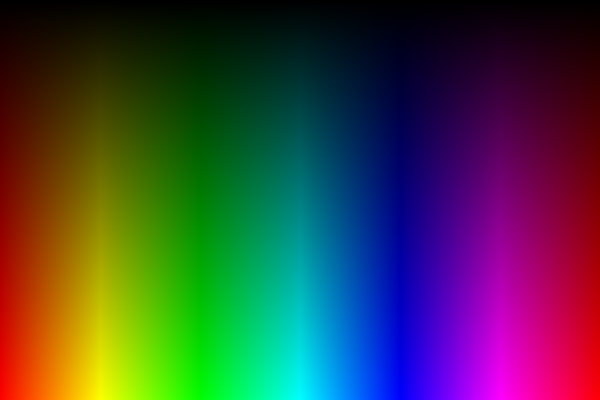

# Graphics

Playing around with some graphics stuff.. nothing specific right now :p

## Some examples

Rendering a graph of hue-value color space to a file:
```lisp
(write-pixmap (generate (600 400) (x y) (width height)
			(make-color :hue (make-turns (/ x width))
				    :value (/ y height)))
	      *outfile* :overwrite t)
```
Resulting image:



---

Rendering a... frog? to a file using constructive solid geometry!
```lisp
(defparameter *csg-frog*
  (csg-union
   (csg-transform (make-csg-circle)
		  (make-scaling (vector 3/2 1)))
   (csg-transform
    (csg-transform (make-csg-circle)
		   (make-scaling (vector 1/8 1/8)))
    (make-translation (vector -2/3 -1)))
   (csg-transform
    (csg-transform (make-csg-circle)
		   (make-scaling (vector 1/8 1/8)))
    (make-translation (vector 2/3 -1)))))
    
(write-pixmap (rasterize (-3 -2) (3 2) (300 200)
			 *csg-frog*
			 :fg (make-color :hue (make-turns 1/3))
			 :bg (make-color :hue (make-turns 2/3)))
	      *outfile* :overwrite t)
```
Resulting image:

